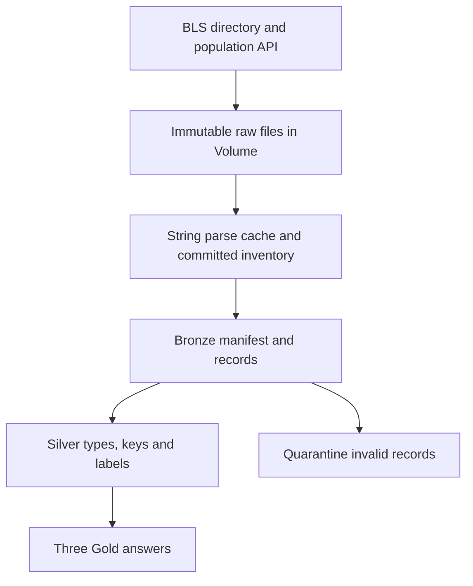

# Design decisions and process

This is a prepared solution and handoff. The owner must review the code and update
the retrospective after running it in Databricks. Managed workspace execution,
screenshots and remote repository publication are not claimed as completed.

## Architecture

The ingestion notebook creates a Unity Catalog Volume and uses a standard-library
HTTP client to discover every direct file in the BLS productivity directory. It
also fetches the specified Data USA population JSON. Discovery does not hardcode a
list of filenames. Parsing does use explicit contracts for known BLS file roles;
unknown future files are still retained as raw bytes for review.

The parse cache is a serialization convenience, not a curated table: original strings,
row numbers, source filenames and content identities remain available. No numeric
modeling or deduplication occurs before the declarative pipeline. Bronze, Silver and
Gold tables are all defined as managed materialized views in the Spark Declarative
Pipeline, materialized by Databricks as Delta-backed datasets.

- **Bronze manifest** selects the latest complete inventory. Each row traces to an
  immutable raw object, its URL, digest and HTTP validators.
- **Bronze records** semi-joins cached string records to active object IDs. Replaced
  and deleted files therefore stop contributing; historical raw/cache objects remain.
- **Silver observations** trims fields, casts year and decimal values, checks keys,
  quarantines malformed values, and deduplicates Current/AllData overlaps.
- **Silver population** handles the API's integral numeric values such as `316128839.0`,
  rejects fractional counts, filters US nation rows and enforces one count per year.
- **Silver series** joins sector, employee class, measure, duration and seasonal
  lookups. It includes index base from current metadata when applicable.
- **Gold** implements the three requested answers. Python/PySpark is primary so pure
  transformation functions can be tested outside the managed pipeline. Equivalent
  SQL files express aggregation/window/left-join logic independently, and a notebook
  compares both alternatives with the actual Gold tables.

## Provider interpretation

The implementation was checked against BLS's own documentation and current files.
Quarter codes Q01–Q04 represent quarters; Q05 represents the annual average, so Q05
must not inflate quarterly totals. Current and AllData overlap; concatenation followed
by naive summation would double-count observations. A series code alone is not a label.
Duration distinguishes an index from different percent-change measures.

The old BLS text documentation mentions an obsolete index base. This solution uses
`base_year` from the current series metadata, not a hardcoded base. A live pull also
revealed `Seasonal_code`/`Seasonal_text` capitalization despite the lowercase names
in the documentation; the parser normalizes header case and whitespace.

For population, the supplied Tesseract endpoint returns a `data` array, metadata and
page information. An incomplete page is rejected rather than silently accepted. The
current national annual response is small and complete; if pagination is introduced,
a future change must fetch all pages consistently before publication.

## Reruns, revisions and deletions

1. Fetch and parse the directory listing using a real contact email in `User-Agent`.
2. Send conditional GETs using ETag, or Last-Modified when ETag is absent.
3. On 304, reuse the immutable raw file and parsed object. On 200, hash the bytes;
   an unchanged hash avoids reparsing and rewriting even if validators are absent.
4. New/changed files create new content-addressed raw and parsed objects. Neither
   source filenames nor content hashes are used as SQL identifiers.
5. Re-fetch the listing; reject the candidate if the listing changed during the pull.
6. Publish one full-inventory manifest only after all files are available. Deleted
   filenames are recorded and omitted from the active inventory.
7. A fully unchanged run writes nothing. A failed fetch does not publish a candidate.

A reread for change detection is not always avoidable: if a provider does not supply
reliable validators, the bytes must be downloaded to determine whether they changed.
There is no guarantee against a provider serving incorrect validators. The listing
stability check reduces mixed-release risk but cannot create an upstream transaction
across BLS and Data USA. Conflicting observations fail closed downstream.

**Idempotency scope:** ingestion skips identical objects and parsing, and downstream
business keys remain unique. Batch materialized-view refreshes may rescan historical
parse files and recompute transformations. This is not a claim of exactly-once network
delivery or fully incremental Spark execution. For a small quarterly source, explicit
snapshot replacement is easier to explain and correctly propagates revisions/deletions.

## Analytical choices

- Q1 treats the six specified years as the full population of interest, so `stddev_pop`
  is primary. `stddev_samp` is also returned to make the ambiguity explicit. Exactly
  six distinct years must survive validation; a partial answer fails.
- Q2 sums available non-null quarterly values, even for incomplete years, because the
  question does not require four quarters. `quarters_available` makes this visible.
  Tied sums use the earliest year. All-null and annual-only series get no best year;
  they remain in the result with status `no_quarterly_observations`.
- Q2 is the assignment's arithmetic ranking, not a claim that adding percent-change
  measures produces an economically meaningful annual growth rate.
- Q3 uses a left join from the specified BLS observations; absent population is null,
  never zero, carried forward or interpolated.
- Missing BLS values (`-` or empty) remain null, not zero. Unexpected text is quarantined.
  Duplicate observations with different numeric values fail; footnote variants remain
  as a set of source evidence. A null and a number for the same key also conflict.

## Quality and trade-offs

- File contracts fail on missing columns or malformed row width; added columns are
  preserved in Bronze. All known analytical columns have explicit Silver types.
- Expectations fail on conflicting duplicates, missing metadata labels and inadequate
  population coverage. Invalid typed records are visible in quarantine and counted
  through expectations; the acceptance notebook requires empty quarantine for submission.
- The implementation is a **single-writer** workflow. The bundle limits its own job
  concurrency, but cannot prevent someone launching a second manual notebook. Production
  would use a transactional control table/lease and transactional snapshot publication.
- Immutable objects make retry recovery easy, but orphaned files and old snapshots
  accumulate. Production needs retention, compaction and safe garbage collection.
- The single small manifest is written last, but Volume FUSE is not an atomic multi-file
  transaction. An interrupted/truncated manifest fails closed and needs operator repair.
  A production version would commit inventory in a Delta transaction.
- At larger volume, parse files with native Spark readers and persist active inputs as
  Delta with CDC/tombstones. Current parsing holds one small BLS file in driver memory;
  content-addressed JSON increases storage and all-history scanning cost.
- A production deployment would separate catalogs/schemas and service principals by
  environment, give analysts SELECT on Gold only, and use group-based permissions.
  The optional SQL template illustrates this but has not granted anyone access.
- Monitoring should include successful-source time, missing coverage, retries, size
  changes, quarantine counts, duplicate conflicts, expectation failures and costs.
  Schedule after the provider's release, not a constant polling loop.
- Free Edition quotas and available features can differ from client workspaces.
  The supplied bundle requires real workspace validation before it is considered deployed.

## Retrospective and AI disclosure

Observed engineering challenges were provider header inconsistency, overlapping BLS
files, annual-average rows, and distinguishing ingestion idempotency from recomputation.
The seasonal-header issue was found by executing a real-provider ingestion, then fixed
with a contract-preserving normalization change. The local test environment also needed
Spark worker setup; that is separate from Databricks runtime validation.

AI usage to disclose accurately: **OpenAI Codex prepared the implementation,
documentation and local tests, consulted provider/platform documentation, and investigated
execution failures.** The owner is responsible for reviewing every line, running the
Databricks workload, adding actual screenshots and explaining the design in interview.
Do not claim this code was independently authored or tested in Databricks by the owner
until that work actually happens. Add a short personal retrospective after the workspace run.

## Sources consulted

- [BLS PR file documentation](https://download.bls.gov/pub/time.series/pr/pr.txt)
- [BLS directory](https://download.bls.gov/pub/time.series/pr/)
- [BLS automated access policy](https://www.bls.gov/bls/pss.htm)
- [Data USA Tesseract API documentation](https://datausa.io/about/api/)
- [Databricks pipeline Python reference](https://docs.databricks.com/aws/en/ldp/developer/python-ref)
- [Databricks expectations](https://docs.databricks.com/aws/en/ldp/expectations)
- [Databricks bundle resources](https://docs.databricks.com/aws/en/dev-tools/bundles/resources)
